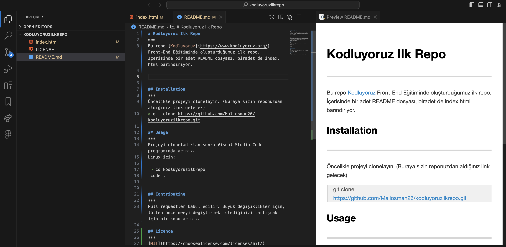

# Kodluyoruz Ilk Repo

Bu repo [Kodluyoruz](https://www.kodluyoruz.org/) Front-End Eğitiminde oluşturduğumuz ilk repo. İçerisinde bir adet README dosyası, biradet de index.html barındırıyor.



## Installation

Öncelikle projeyi clonelayın. (Buraya sizin reponuzdan aldığınız link gelecek)

```bash
git clone https://github.com/Maliosman26/kodluyoruzilkrepo.git
```

## Usage 

Projeyi cloneladıktan sonra Visual Studio Code programında açınız.
Linux için:

```linux
 cd kodluyoruzilkrepo
 code .
```

## Contributing 

Pull requestler kabul edilir. Büyük değişiklikler için, lütfen önce neeyi değiştirmek istediğinizi tartışmak için bir konu açınız.

## Licence

[MIT](https://choosealicense.com/licenses/mit/)